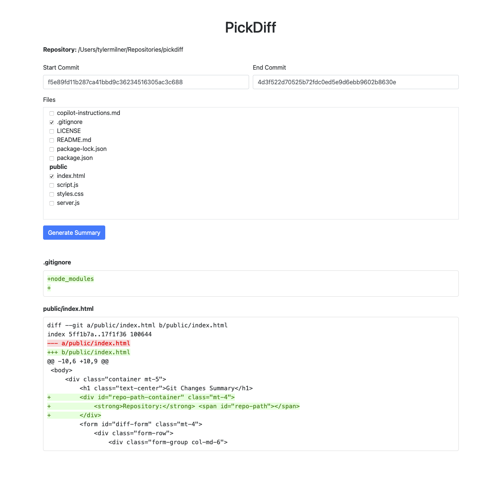

# PickDiff

A simple frontend web application that runs locally and provides a user-friendly interface to display a visual diff of selected files between two commits in a Git repository.

## Problem Solved

Traditional `git diff` commands can be difficult to read and manage, especially when focusing on specific file changes across different commits. This tool aims to simplify the process by offering a graphical interface to select files and visualize their differences.



## Features

- Select start and end commits for comparison.
- Browse and select specific files from the repository to diff.
- View a color-coded, line-by-line diff for selected files.

## Technologies Used

- **Backend:** Node.js with Express.js
- **Git Integration:** `simple-git` library
- **Frontend:** HTML, CSS (Bootstrap), JavaScript

## Setup and Installation

To get this application running on your local machine, follow these steps:

1.  **Clone the repository:**

    ```bash
    git clone <repository-url>
    cd pickdiff
    ```

2.  **Install dependencies:**

    ```bash
    npm install
    ```

## How to Run

After installation, you can start the application. By default, it will use the current working directory as the Git repository.

```bash
npm start
```

Alternatively, you can specify a different repository path by providing it as a command-line argument:

```bash
npm start -- /path/to/your/repo
```

For development with automatic server restarts on file changes, use:

```bash
npm run dev
```

In all cases, the application will be accessible in your web browser, usually at `http://localhost:3000`.

## Usage

1.  Start the application using one of the methods above.
2.  Open your web browser and navigate to `http://localhost:3000`.
3.  The repository path being used will be displayed at the top of the page.
4.  Enter the **Start Commit** hash and **End Commit** hash in the respective input fields. These can be full commit hashes or any Git reference (e.g., `HEAD~1`, `main`, `develop`).
5.  The file tree will display all tracked files in your repository. Select the files you wish to compare by checking the boxes next to their names.
6.  Click the "Generate Summary" button.
7.  The application will display the diffs for the selected files, with additions highlighted in green and deletions in red.

## License

This project is licensed under the [MIT License](./LICENSE).
